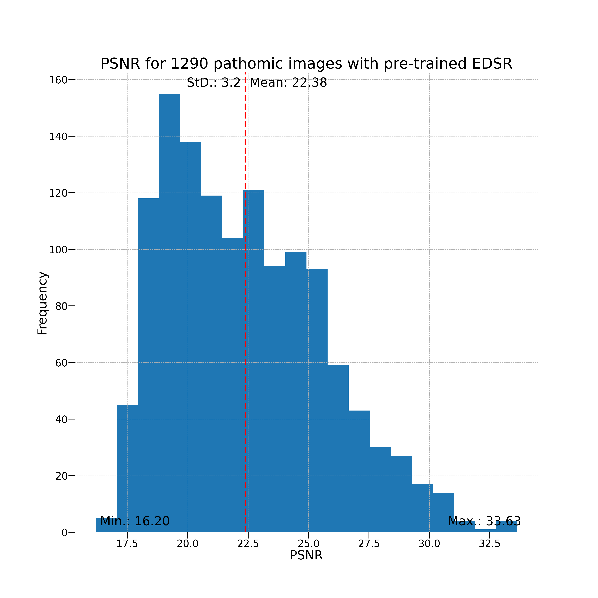
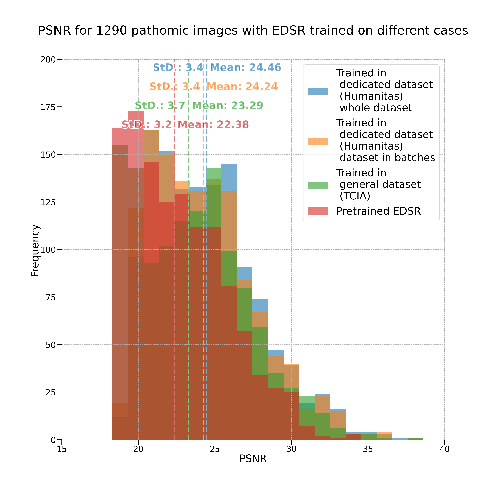

## Content of this folder

In this folder we have the following Jupyter Notebooks:

* 0_The_EDSRx4_model
* 1_Preparing_the_datasets
* 2_Freezing_layers
* 3_Other_modifications
* 4_Training_and_Testing
* EDSR_Display_on_SVS_image
* Histograms_and_Boxplots
* Reading_log_files

They are properly explained by themselves, but we will give a summary for each below.

## 0_The_EDSRx4_model

Explains how to get the model and see its structure. How to set it up, load it and see its structure either by printing it directly or using the summary function from the torchinfo library. It also shows how to use it for Testing (model application on images) and Training.

## 1_Preparing_the_datasets

Explains how we prepared both of our datasets: where we took the images from and how we prepared them to be a suitable dataset to train the EDSR x4 model.

## 2_Freezing_layers

Explains how to disable gradients on layers of the model to prevent them from being updated during training, if desired. It also explains how to set and use our module [freeze.py](../../EDSR-PyTorch/src/freeze.py), as well as how to add its pertinent arguments to the main.py script, in order to be able to "freeze" (disable gradients) on desired layers during training.

## 3_Other_modifications

Explains how to set up the new argument we produced "save_models_each". This argument allows the user to control how many state dictionaries of trained models are stored in disk while passing the "save" argument to the main.py script, instead of saving them for each epoch.

It also mentions our [main_use.py](../../EDSR-PyTorch/src/main_use.py) script and how to use it. This script is what we consider a minimal version of the original main.py script made by its authors.

## 4_Training_and_Testing

Explains in a single Notebook how to set up the original EDSR-PyTorch repository in order to add all of our modifications and contributions, for Testing and Training of the EDSR x4 model. It could be useful as well as a "how-to" guide to use the EDSR x4 model for Training and Testing (application of the model on images).

## EDSR_Display_on_SVS_image

Explains how to select a crop of a High-Resolution (HR) image in SVS format, downscale it by a factor 4, and then upscale it with a Bicubic algorithm and 2 different trained EDSR x4 models, and comparing the upscaled version with the original HR crop, like this image:

The user must provide all corresponding files and parameters in order to do so. For more information, check the Notebook.

## Histograms_and_Boxplots

Explains how to make Histograms and Boxplots to display our measured data (in .csv format) produced by our scripts. We can see examples of .csv files in the [Example-files/Measures](../../Example-files/Measures) folder of our repository. Examples of figures outputs are:

1. Histogram from a single set of measurements

2. Compare histograms

3. Making box plots to compare data

4. Making figures from Segmentation measures
4.1 Histograms

4.2 Boxplots

## Reading_log_files

Explains how to read log.txt files produced by the training of the EDSR x4 model into a dataframe. In particular, it's helpful to merge in a single training curve (average PSNR vs Epochs) the training values (average PSNR per epoch) from several log files corresponding to a training that was performed in several sessions (and hence, several log.txt files). Examples of log files can be found in in the [Example-files/Logs](../../Example-files/Logs) folder of our repository.
