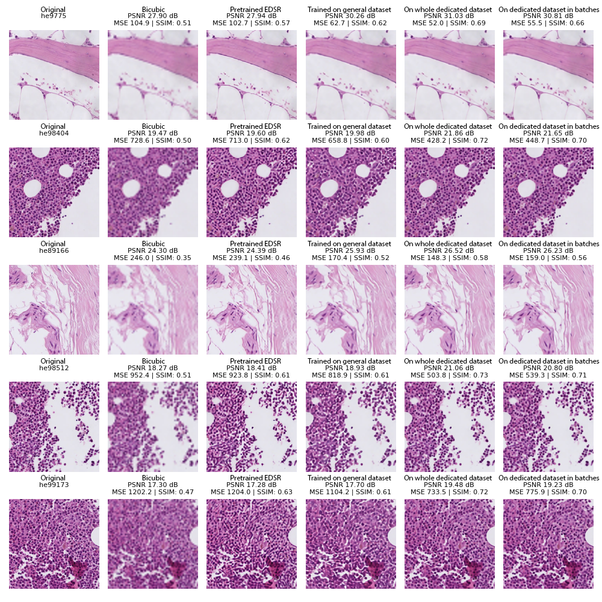

## Content of this folder

In this folder we have the following Python scripts:

* script-bicubic_measuring_with_segmentation.py
* script-displaying_of_models_on_images.py
* script-displaying_of_models_on_images_with_segmentation.py
* script-displaying_on_LR_images_with_segmentation.py
* script-edsr_measuring.py
* script-edsr_measuring_with_segmentation.py

They are meant to be used on a terminal like:

```bash
python script_name.py
```

It's important that before using any of the scripts we first properly set the variables inside each of them. These variables can be found after the function definitions end, below the lines:

```python
###################
# CODE STARTS HERE
###################
```

Additionally, it's important to make sure that all of the employed libraries are properly installed before use. In particular the library [StarDist](https://github.com/stardist/stardist) which we used for Image Segmentation.


## script-edsr_measuring.py

This script will take the Low-Resolution (LR) images from one of our datasets, upscale them by applying EDSR x4 model with the state dictionary file of an already trained model, and measure MSE, PSNR and SSIM between the produced Super-Resolution (SR) image and the corresponding High-Resolution (HR) image from the dataset. It will save the results as a .csv file with the name provided in the variable "csv_file_name" inside of the directory provided in the variable "path_to_save".

Additionally, we should make sure to provide the following variables:

* dir_base: Path to our base directory where our "EDSR-PyTorch" folder should be located.
* dir_dataset: Path to directory with the dataset. Inside there must be the "Custom" folder with the dataset, with the respect "HR" and "LR_bicubic/X4" subfolders, with the HR and LR images respectively, with their expected filename structure. (More info about it in our Jupyter Notebook [2_Freezing_layers](../../Notebooks-scripts/Notebooks/2_Freezing_layers.ipynb)).
* range_of_interest: The range of images to use from all of the images in the dataset provided. It is formatted as "start-end", with the first and last image number/position to be used (both included).
* pretrain_path: Path to the state dictionary file (in .pt format) of the trained model we want to use.

We must be sure to comment and un-comment the appropriated lines, or write our own lines.


## script-edsr_measuring_with_segmentation.py

Analogous version of script-edsr_measuring.py but instead of measuring MSE, PSNR and SSIM between the HR and SR images, would perform segmentation on them and measure the corresponding metrics by using the [StarDist](https://github.com/stardist/stardist) library.

For our work we used their "2D_versatile_he" model with scale=3. The list of available metrics are the following:

```python
available_metrics = ["criterion", "thresh", "fp", "tp", "fn", "precision", "recall", "accuracy",
                       "f1", "n_true", "n_pred", "mean_true_score", "mean_matched_score", "panoptic_quality"]
```


## script-bicubic_measuring_with_segmentation.py

Analogous version of script-edsr_measuring_with_segmentation.py but instead of using the EDSR x4 model to upscale the LR images, would use a Bicubic algorithm instead.


## script-displaying_of_models_on_images.py

This script will take a random sample of images from the Low-Resolution (LR) images from one of our datasets, upscale them with a Bicubic algorithm and by applying EDSR x4 model with each of the provided state dictionary files of already trained models, and measure MSE, PSNR and SSIM between the upscaled images and the corresponding High-Resolution (HR) image from the dataset, and display them in a composition.

The composition will be saved in PNG format inside of the directory provided in the variable "path_to_save", with the following file name:

```python
comp_name = f"composition_from_sample_in_range{range_start_formatted}-{range_end_formatted}"
```

Where range_start_formatted and range_end_formatted are respectively the first and last image number/position in a range of image we provided from our LR images. (They are "formatted" to have the same number of digits that the number of images in the dataset have, i.e., if start_image=1 and end_image=100, for a dataset of 2500 images, then range_start_formatted would be "0001" and range_end_formatted would be "0100").

Additionally, we should make sure to provide the following variables:

* dir_base: Path to our base directory where our "EDSR-PyTorch" folder should be located.
* dir_dataset: Path to directory with the dataset. Inside there must be the "Custom" folder with the dataset, with the respect "HR" and "LR_bicubic/X4" subfolders, with the HR and LR images respectively, with their expected filename structure. (More info about it in our Jupyter Notebook [2_Freezing_layers](../../Notebooks-scripts/Notebooks/2_Freezing_layers.ipynb)).
* list_of_edsr_pretrain_paths: List of the paths to the state dictionary files (in .pt format) of the trained models we want to use.
* list_of_edsr_names: List of the corresponding label names of the models provided in list_of_edsr_pretrain_paths.
* start_image: Starting image of the range of images to use to pick a random sample from, of all of the images in the dataset provided.
* end_image : Ending image of the range of images to use to pick a random sample from, of all of the images in the dataset provided.
* number_of_samples: Number of images to randomly take from the range of images.

Alternatively, if we prefer to provide a list of images to use directly instead of a random sample, we can change in line 454 the variable "sample_of_images", and assign the a list with the paths to our images of interest. We could also change "comp_name" in line 461 to give our final composition another file name.

An example of a composition made by this script would be:




## script-displaying_of_models_on_images_with_segmentation.py

Analogous version of script-displaying_of_models_on_images.py, but instead of measuring MSE, PSNR and SSIM, we performed segmentation with the [StarDist](https://github.com/stardist/stardist) library. We should follow the same instructions as described above for script-displaying_of_models_on_images.py.

For this case, the images with the segmentation will be placed right below their versions without segmentation.

Additionally, we should make sure to provide the following variables:

* seg_scale: Scale value to use with the segmentation (for us, 3 was producing better results than the default value).
* force_color: If we provide an array/list with the pixels values of a color in RGBA mode (i.e. [0-255, 0-255, 0-255, 0-1]), we will force all segmentation shapes to be of that color. The default value is "None".
* metrics_names: List of metrics names to include in the final composition. (We provided a list of available metrics name above when talking about the script-edsr_measuring_with_segmentation.py script).

An example of a composition made by this script would be:


## script-displaying_on_LR_images_with_segmentation.py

This script will take all images (with the file_extension provided) inside of a directory provided as the variable "image_folder", upscale them with a Bicubic algorithm and the EDSR x4 model (with the path to the state dictionary of a trained model provided in the variable "edsr_pretrain_path"), perform segmentation with the [StarDist](https://github.com/stardist/stardist) library and make a composition of the original (Low-Resolution) images and their respective upscalings with segmentations.

We can provide a label name for the SR image produced to the variable "edsr_name".

It is also possible to show one of the available segmentation metrics by providing its name to the variable "metrics_name". (We provided a list of available metrics name above when talking about the script-edsr_measuring_with_segmentation.py script).

The figure size can be either provided to the variable fig_size, otherwise it will be dynamically determined on the lines 404-406.

Information about the other variables were explained above when talking about the script-displaying_of_models_on_images.py and script-displaying_of_models_on_images_with_segmentation.py scripts.

An example of a composition made by this script would be:


